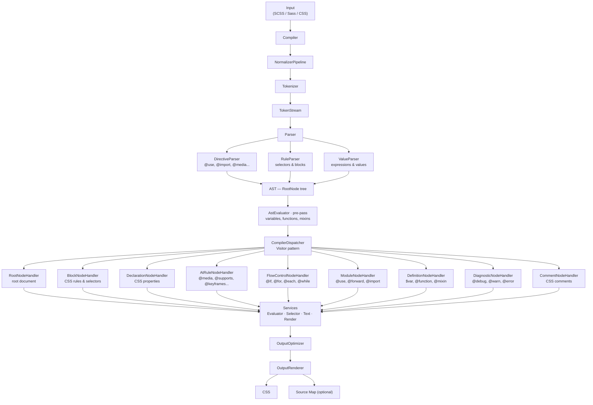

# Sass/SCSS PHP Compiler


[](https://coveralls.io/github/dragomano/scss-php?branch=main)

## Features

- Sass and SCSS compilation to CSS
- `@use`, `@forward`, `@import`, built-in Sass modules, and modern color functions
- Optional source maps and rule splitting
- PSR-3 logging for `@debug`, `@warn`, and `@error`
- Replaceable color engine via `ColorBundleInterface`

---

## Requirements

- PHP >= 8.2

---

## Installation via Composer

```bash
composer require bugo/scss-php
```

## Usage examples

### Compiling from a string

```php
<?php

require __DIR__ . '/vendor/autoload.php';

use Bugo\SCSS\Compiler;
use Bugo\SCSS\Syntax;

$compiler = new Compiler();

// SCSS
$scss = <<<'SCSS'
@use 'sass:color';

$color: red;
body {
  color: $color;
}
footer {
  background: color.adjust(#6b717f, $red: 15);
}
SCSS;

$css = $compiler->compileString($scss);

var_dump($css);

// Sass
$sass = <<<'SASS'
@use 'sass:color';

$color: red;
body
  color: $color;
footer
  background: color.adjust(#6b717f, $red: 15);
SASS;

$css = $compiler->compileString($sass, Syntax::SASS);

var_dump($css);
```

### Compiling from a file

```php
<?php

require __DIR__ . '/vendor/autoload.php';

use Bugo\SCSS\Compiler;
use Bugo\SCSS\CompilerOptions;
use Bugo\SCSS\Loader;
use Bugo\SCSS\Style;

$compiler = new Compiler(
    options: new CompilerOptions(style: Style::COMPRESSED, sourceMapFile: 'assets/app.css.map'),
    loader: new Loader(['styles/']),
);

$css = $compiler->compileFile(__DIR__ . '/assets/app.scss');

file_put_contents(__DIR__ . '/assets/app.css', $css);

echo "CSS compiled!\n";
```

If `sourceMapFile` is set, the compiler writes the source map itself and appends a `sourceMappingURL` comment to the returned CSS.

### Caching compiled files with PSR-16

`CachingCompiler` caches only `compileFile()`. It tracks every loaded dependency and invalidates the cache if any imported or used file changes.

```php
<?php

require __DIR__ . '/vendor/autoload.php';

use Bugo\SCSS\Cache\CachingCompiler;
use Bugo\SCSS\Cache\TrackingLoader;
use Bugo\SCSS\Compiler;
use Bugo\SCSS\CompilerOptions;
use Bugo\SCSS\Loader;
use Bugo\SCSS\Style;
use Symfony\Component\Cache\Adapter\FilesystemAdapter;
use Symfony\Component\Cache\Psr16Cache;

$options = new CompilerOptions(
    style: Style::COMPRESSED,
    sourceMapFile: __DIR__ . '/assets/app.css.map',
);

$trackingLoader = new TrackingLoader(new Loader([__DIR__ . '/styles']));
$compiler = new Compiler($options, $trackingLoader);
$cache = new Psr16Cache(new FilesystemAdapter(namespace: 'scss', directory: __DIR__ . '/var/cache/scss'));

$cachedCompiler = new CachingCompiler(
    $compiler,
    $cache,
    $trackingLoader,
    $options,
);

$css = $cachedCompiler->compileFile(__DIR__ . '/assets/app.scss');

file_put_contents(__DIR__ . '/assets/app.css', $css);
```

Notes:
- Pass the same `TrackingLoader` instance to both `Compiler` and `CachingCompiler`.
- `compileString()` is delegated directly and is not cached.
- `psr/simple-cache` is included by this package, but you still need a PSR-16 cache implementation such as `symfony/cache`, Laravel cache, or another compatible backend.

### CompilerOptions reference

| Option            | Type      | Default           | Description                                                    |
|-------------------|-----------|-------------------|----------------------------------------------------------------|
| `style`           | `Style`   | `Style::EXPANDED` | Output style: `EXPANDED` or `COMPRESSED`                       |
| `sourceFile`      | `string`  | `'input.scss'`    | Source file name used in source maps                           |
| `outputFile`      | `string`  | `'output.css'`    | Output file name used in source maps                           |
| `sourceMapFile`   | `?string` | `null`            | Path to write the source map file; `null` disables source maps |
| `includeSources`  | `bool`    | `false`           | Embed source content in source map (`sourcesContent`)          |
| `outputHexColors` | `bool`    | `false`           | Normalize supported functional colors to hex on output         |
| `splitRules`      | `bool`    | `false`           | Split multi-selector rules into separate rules                 |
| `verboseLogging`  | `bool`    | `false`           | Log all `@debug` messages (otherwise only `@warn`/`@error`)    |

### Logging `@debug`, `@warn`, `@error` with any PSR-3 logger

```php
<?php

require __DIR__ . '/vendor/autoload.php';

use Bugo\SCSS\Compiler;
use Monolog\Formatter\LineFormatter;
use Monolog\Handler\StreamHandler;
use Monolog\Logger;

$formatter = new LineFormatter("[%datetime%] %level_name%: %message%\n");

$handler = new StreamHandler('php://stdout');
$handler->setFormatter($formatter);

$logger = new Logger('sass');
$logger->pushHandler($handler);

// Inject logger in constructor
$compiler = new Compiler(logger: $logger);

$scss = <<<'SCSS'
@debug "Build started";
@warn "Using deprecated token";
// @error "Fatal style issue";

.button {
  color: red;
}
SCSS;

$css = $compiler->compileString($scss);
echo $css;
```

Notes:
- `@debug` -> `$logger->debug(...)`
- `@warn`  -> `$logger->warning(...)`
- `@error` -> `$logger->error(...)` and compilation throws `Bugo\SCSS\Exceptions\SassErrorException`

## How It Works



---

## Comparison with other packages

See the [benchmark.md](benchmark.md) file for results.

`benchmark.php` includes both the regular `bugo/scss-php` compiler and a separate `bugo/scss-php+cache` scenario so you can compare repeated `compileFile()` runs with warm cache hits.

## Found a bug?

Paste the problematic code into the [sandbox](https://sass-lang.com/playground/), then send:

- the sandbox link
- the actual result from this package
- the expected result

## Want to add something?

Don't forget to test and tidy up your code before submitting a pull request.

## Custom Color Engine

By default, the compiler uses the bundled color engine. You can replace it entirely by implementing `ColorBundleInterface`.

This is a full integration point, not a small extension hook: in practice you need to provide compatible converter, literal parser/serializer, polar math, and manipulator implementations.

```php
use Bugo\SCSS\Compiler;
use Bugo\SCSS\Contracts\Color\ColorBundleInterface;
use Bugo\SCSS\Contracts\Color\ColorConverterInterface;
use Bugo\SCSS\Contracts\Color\ColorLiteralInterface;
use Bugo\SCSS\Contracts\Color\ColorManipulatorInterface;
use Bugo\SCSS\Contracts\Color\ColorValueInterface;

// 1. Your color data container
final class MyColorValue implements ColorValueInterface
{
    public function __construct(
        private readonly string $space,
        /** @var list<float|null> */
        private readonly array $channels,
        private readonly float $alpha = 1.0,
    ) {}

    public function getSpace(): string { return $this->space; }
    public function getChannels(): array { return $this->channels; }
    public function getAlpha(): float { return $this->alpha; }
}

// 2. Space converter + router (see ColorConverterInterface for all required methods)
final class MyColorConverter implements ColorConverterInterface { /* ... */ }

// 3. CSS color string parser/serializer
final class MyColorLiteral implements ColorLiteralInterface
{
    public function parse(string $css): ?ColorValueInterface { /* ... */ }
    public function serialize(ColorValueInterface $color): string { /* ... */ }
}

// 4. Color manipulation (mix, grayscale, adjust, scale, etc.)
final class MyColorManipulator implements ColorManipulatorInterface { /* ... */ }

// 5. Bundle everything together
final class MyColorBundle implements ColorBundleInterface
{
    public function getConverter(): ColorConverterInterface { return new MyColorConverter(); }
    public function getLiteral(): ColorLiteralInterface { return new MyColorLiteral(); }
    public function getManipulator(): ColorManipulatorInterface { return new MyColorManipulator(); }
}

// 6. Pass the bundle to the compiler
$compiler = new Compiler(colorBundle: new MyColorBundle());
$css = $compiler->compileString('$c: oklch(50% 0.2 120deg); .a { color: $c; }');
```
