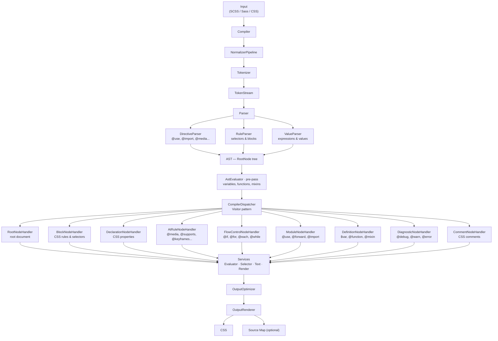

# Sass/SCSS PHP Compiler


[](https://coveralls.io/github/dragomano/scss-php?branch=main)

## Особенности

- Компиляция Sass и SCSS в CSS
- Поддержка `@use`, `@forward`, `@import`, встроенных Sass-модулей и современных цветовых функций
- Опциональные source maps и разделение правил
- PSR-3 логирование для `@debug`, `@warn` и `@error`
- Возможность полностью заменить цветовой движок через `ColorBundleInterface`

---

## Требования

- PHP >= 8.2

---

## Установка через Composer

```bash
composer require bugo/scss-php
```

## Примеры использования

### Компиляция строки

```php
<?php

require __DIR__ . '/vendor/autoload.php';

use Bugo\SCSS\Compiler;
use Bugo\SCSS\Syntax;

$compiler = new Compiler();

// SCSS
$scss = <<<'SCSS'
@use 'sass:color';

$color: red;
body {
  color: $color;
}
footer {
  background: color.adjust(#6b717f, $red: 15);
}
SCSS;

$css = $compiler->compileString($scss);

var_dump($css);

// Sass
$sass = <<<'SASS'
@use 'sass:color';

$color: red;
body
  color: $color;
footer
  background: color.adjust(#6b717f, $red: 15);
SASS;

$css = $compiler->compileString($sass, Syntax::SASS);

var_dump($css);
```

### Компиляция файла

```php
<?php

require __DIR__ . '/vendor/autoload.php';

use Bugo\SCSS\Compiler;
use Bugo\SCSS\CompilerOptions;
use Bugo\SCSS\Loader;
use Bugo\SCSS\Style;

$compiler = new Compiler(
    options: new CompilerOptions(style: Style::COMPRESSED, sourceMapFile: 'assets/app.css.map'),
    loader: new Loader(['styles/']),
);

$css = $compiler->compileFile(__DIR__ . '/assets/app.scss');

file_put_contents(__DIR__ . '/assets/app.css', $css);

echo "CSS скомпилирован!\n";
```

Если задан `sourceMapFile`, компилятор сам записывает source map и добавляет в возвращаемый CSS комментарий `sourceMappingURL`.

### Параметры CompilerOptions

| Параметр         | Тип       | По умолчанию      | Описание                                                       |
|------------------|-----------|-------------------|----------------------------------------------------------------|
| `style`          | `Style`   | `Style::EXPANDED` | Стиль вывода: `EXPANDED` или `COMPRESSED`                      |
| `sourceFile`     | `string`  | `'input.scss'`    | Имя исходного файла для source map                             |
| `outputFile`     | `string`  | `'output.css'`    | Имя выходного файла для source map                             |
| `sourceMapFile`  | `?string` | `null`            | Путь к файлу source map; `null` отключает генерацию source map |
| `includeSources` | `bool`    | `false`           | Встроить исходный код в source map (`sourcesContent`)          |
| `outputHexColors` | `bool`   | `false`           | Нормализовать поддержанные функциональные цвета в hex          |
| `splitRules`     | `bool`    | `false`           | Разбить правила с несколькими селекторами на отдельные         |
| `verboseLogging` | `bool`    | `false`           | Логировать все `@debug` (иначе только `@warn`/`@error`)        |

### Логирование `@debug`, `@warn`, `@error` через любой PSR-3 логгер

```php
<?php

require __DIR__ . '/vendor/autoload.php';

use Bugo\SCSS\Compiler;
use Monolog\Formatter\LineFormatter;
use Monolog\Handler\StreamHandler;
use Monolog\Logger;

$formatter = new LineFormatter("[%datetime%] %level_name%: %message%\n");

$handler = new StreamHandler('php://stdout');
$handler->setFormatter($formatter);

$logger = new Logger('sass');
$logger->pushHandler($handler);

// Передать логгер в конструктор
$compiler = new Compiler(logger: $logger);

$scss = <<<'SCSS'
@debug "Сборка началась";
@warn "Используется устаревший токен";
// @error "Критическая ошибка стилей";

.button {
  color: red;
}
SCSS;

$css = $compiler->compileString($scss);
echo $css;
```

Примечания:
- `@debug` -> `$logger->debug(...)`
- `@warn`  -> `$logger->warning(...)`
- `@error` -> `$logger->error(...)`, а компиляция выбрасывает `Bugo\SCSS\Exceptions\SassErrorException`

## Как это работает



---

## Сравнение с другими пакетами

Смотрите файл [benchmark.md](benchmark.md) для просмотра результатов.

## Нашли ошибку?

Вставьте проблемный код в [песочницу](https://sass-lang.com/playground/), затем пришлите:

- ссылку на sandbox
- фактический результат этого пакета
- ожидаемый результат

## Хотите что-то добавить?

Не забудьте протестировать и привести в порядок свой код, прежде чем отправлять пулреквест.

## Пользовательский цветовой движок

По умолчанию компилятор использует встроенный цветовой движок. Его можно полностью заменить, реализовав `ColorBundleInterface`.

Это не маленькая точка расширения, а полноценная интеграция: на практике нужно предоставить совместимые реализации конвертера, парсера/сериализатора литералов, полярной математики и манипулятора цветов.

```php
use Bugo\SCSS\Compiler;
use Bugo\SCSS\Contracts\Color\ColorBundleInterface;
use Bugo\SCSS\Contracts\Color\ColorConverterInterface;
use Bugo\SCSS\Contracts\Color\ColorLiteralInterface;
use Bugo\SCSS\Contracts\Color\ColorManipulatorInterface;
use Bugo\SCSS\Contracts\Color\ColorValueInterface;

// 1. Ваш контейнер данных цвета
final class MyColorValue implements ColorValueInterface
{
    public function __construct(
        private readonly string $space,
        /** @var list<float|null> */
        private readonly array $channels,
        private readonly float $alpha = 1.0,
    ) {}

    public function getSpace(): string { return $this->space; }
    public function getChannels(): array { return $this->channels; }
    public function getAlpha(): float { return $this->alpha; }
}

// 2. Конвертер пространств и роутер (см. ColorConverterInterface для полного контракта)
final class MyColorConverter implements ColorConverterInterface { /* ... */ }

// 3. Парсер и сериализатор CSS-цветов
final class MyColorLiteral implements ColorLiteralInterface
{
    public function parse(string $css): ?ColorValueInterface { /* ... */ }
    public function serialize(ColorValueInterface $color): string { /* ... */ }
}

// 4. Манипуляции с цветами (mix, grayscale, adjust, scale и т.д.)
final class MyColorManipulator implements ColorManipulatorInterface { /* ... */ }

// 5. Собрать все в bundle
final class MyColorBundle implements ColorBundleInterface
{
    public function getConverter(): ColorConverterInterface { return new MyColorConverter(); }
    public function getLiteral(): ColorLiteralInterface { return new MyColorLiteral(); }
    public function getManipulator(): ColorManipulatorInterface { return new MyColorManipulator(); }
}

// 6. Передать bundle в компилятор
$compiler = new Compiler(colorBundle: new MyColorBundle());
$css = $compiler->compileString('$c: oklch(50% 0.2 120deg); .a { color: $c; }');
```

## Дополнительные ресурсы

* https://dragomano.github.io/dart-sass-docs-russian/
* https://github.com/sass/sass
* https://tc39.es/ecma426/
* https://evanw.github.io/source-map-visualization/
